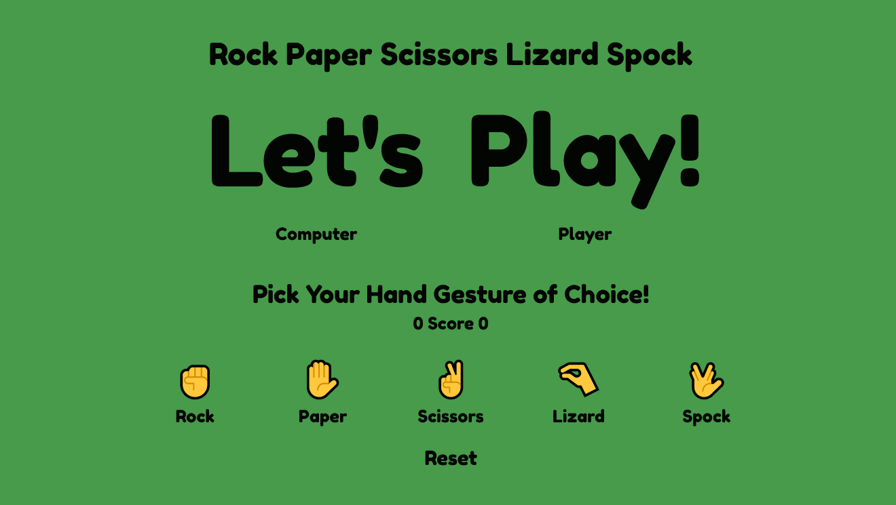

# 01-rock-paper-scissors-lizard-spock

A little spin on the classic game: Rock Paper Scissors Lizard Spock:
* Using Javascript to build the game
* Comparing results with else if statements
* Using emoji's to visually represent the choices
* Using function to generate random cpu choices
* Getting the user input by ID and using this for comparison
* Displaying the winner of each round on screen
* Adding a counter for the number of wins
* Game is responsive with use of Bootstrap
* Adding CSS to give a little retro feel to the game

Have some fun over here:
https://mickdellaert.github.io/01-rock-paper-scissors-lizard-spock/

The rules

    Scissors cut Paper
    Paper covers Rock
    Rock crushes Lizard
    Lizard poisons Spock
    Spock smashes Scissors
    Scissors decapitate Lizard
    Lizard eats Paper
    Paper disproves Spock
    Spock vaporizes Rock
    Rock crushes Scissors

Must-have features

    Have 5 buttons that the player can press to change their pick
    Have another button to let the computer pick one and show the winner
    Let the player know they won (no alert box)
    Have a reset button

Nice-to-have features

    Nice graphics
    Let the player input using a text field
    Show what the player picked by highlighting the correct button
    Add even more options (but avoid using 100 if statements)
    Add complex rules

